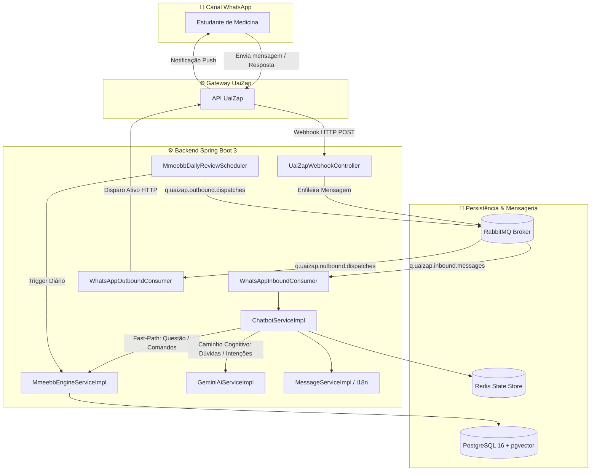

# 🩺 Chatbot de Repetição Espaçada para Medicina (MMEEBB)

<p align="center">
  
  
  
  
  
  
  
  
  
  
</p>

---

## 📖 Sobre o Projeto

Este projeto é o produto de software desenvolvido para o **Trabalho de Conclusão de Curso (TCC)** em **Sistemas de Informação** pelo **Centro Universitário de Patos de Minas (UNIPAM)**:

- **Título**: *Arquitetura e Implementação de um Chatbot de Repetição Espaçada: Automação da Memorização Exponencial na Base Binária*.
- **Autor**: Níckolas Tavares do Nascimento
- **Orientadora**: Profa. Dra. Mislene Dalila da Silva
- **Domínio de Aplicação**: Estudantes do curso de **Medicina** em regime de **Internato Hospitalar** e preparação para **Residência Médica**.

---

## 🧩 O Problema e a Justificativa Científica (POR QUÊ)

1. **Sobrecarga Cognitiva no Internato Médico**:
   - Os estudantes de medicina nos períodos de internato (9º ao 12º período) enfrentam jornadas extenuantes (>40h a 60h semanais).
   - De acordo com **Nelson Cowan (2001)**, o limite de processamento simultâneo na memória de trabalho humana é restrito a aproximadamente **4 *chunks*** de informação.
2. **A Curva do Esquecimento de Ebbinghaus (1885)**:
   - Informações clínicas de alta densidade sofrem rápida degradação mnemônica sem intervenções periódicas ativas.
3. **Fricção das Ferramentas Tradicionais (Anki / Flashcards)**:
   - Softwares tradicionais exigem que o estudante acesse deliberadamente uma plataforma, selecione decks e gerencie revisões ativamente. No cansaço da rotina hospitalar, a taxa de abandono é elevada.
4. **O Modelo Comportamental de BJ Fogg (2009)**:
   - $\text{Comportamento} = \text{Motivação} \times \text{Habilidade (Facilidade)} \times \text{Gatilho (Trigger)}$.
   - A entrega de revisões através de um **Chatbot no WhatsApp** utiliza o canal que o estudante já utiliza continuamente como um **gatilho push ativo**, eliminando a fricção e tornando a revisão um hábito reativo e sem barreiras de acesso.

---

## 📐 Algoritmo Central: MMEEBB

O sistema implementa o **Método de Memorização Exponencial Efetivo na Base Binária** (*Ferreira et al., 2014*):

### 1. Fórmula do Intervalo de Reforço de Aprendizado (IRA)
$$\text{IRA} = 2^n \text{ dias}, \quad n \in [0, 13]$$

| Índice $n$ | Intervalo ($\text{IRA} = 2^n$) | Próxima Revisão Agendada |
| :---: | :---: | :---: |
| **0** | $2^0 = 1$ dia | D+1 (Novo conteúdo / Revisão imediata) |
| **1** | $2^1 = 2$ dias | D+2 após acerto |
| **2** | $2^2 = 4$ dias | D+4 após acerto |
| **3** | $2^3 = 8$ dias | D+8 após acerto |
| **4** | $2^4 = 16$ dias | D+16 após acerto |
| **5** | $2^5 = 32$ dias | D+32 após acerto |
| **...** | ... | ... |
| **13** | $2^{13} = 8192$ dias | Conteúdo plenamente consolidado na memória de longo prazo |

### 2. Transições de Estado
- **Primeiro Contato / Ingestão**: $n = 0 \implies \text{IRA} = 1$ dia.
- **Acerto (Feedback Positivo)**: $n \leftarrow \min(n + 1, 13)$, dobrando o intervalo de tempo até a próxima revisão.
- **Erro (Feedback Negativo)**: $n \leftarrow 0 \implies \text{IRA} = 1$ dia. O conteúdo é reinserido imediatamente na fila de prioridade para reciclagem mnemônica.

---

## 🏛️ Arquitetura do Sistema

A aplicação adota o **Padrão A: Arquitetura Híbrida** com **Arquitetura em Camadas (Layered Architecture)** e desacoplamento via interfaces:

1. **Caminho Rápido / Determinístico (Custo Zero & Latência < 50ms)**:
   - Respostas de questões ativas (`A`, `B`, `C`, `D`, `E`) e comandos clássicos (`ajuda`, `desempenho`, `revisar`) são processados instantaneamente pelas regras de negócio locais e motor MMEEBB.
2. **Caminho Cognitivo (Google Gemini 1.5 Flash)**:
   - Mensagens livres, dúvidas conceituais e solicitações por especialidade são processadas pelo modelo LLM.
   - **Modo Tutor Clínico**: Se o aluno tiver dúvida sobre a última questão respondida, o Gemini atua como preceptor médico explicando a fisiopatologia e raciocínio clínico.
   - **Fallback Seguro**: Se o Gemini estiver desabilitado ou sem chave, o sistema responde com o menu de opções tradicional sem qualquer instabilidade.



### Principais Componentes:
- **`controller`**: Endpoints REST para recepção de webhooks, ingestão de conteúdos (Excel/PDF) e healthchecks.
- **`service` & `service.impl`**: Lógica de negócios desacoplada via interfaces (`ChatbotService`, `MmeebbEngineService`, `GeminiAiService`, `QuestionImportService`, `MessageService`).
- **`consumer`**: Listeners assíncronos do RabbitMQ (`@RabbitListener`) para recepção e envio de mensagens com controle de concorrência e resiliência.
- **`scheduler`**: Agendador de disparos diários (`@Scheduled`) das revisões que atingiram a data de vencimento.
- **`i18n`**: Mensagens internacionalizadas e templates de diálogo centralizados em arquivos de propriedades (`messages_pt_BR.properties`).
- **`controller.GlobalExceptionHandler`**: Tratamento global e padronizado de exceções com resposta estruturada (`ApiErrorResponse`).

---

## 🛠️ Stack Tecnológica

| Camada | Tecnologia | Descrição |
| :--- | :--- | :--- |
| **Linguagem** | Java 17 (LTS) | Padrões modernos, records e tipagem forte |
| **Framework** | Spring Boot 3.3.5 | Web, Data JPA, AMQP, Validation, Actuator, Cache |
| **Inteligência Artificial** | Google Gemini 1.5 Flash | NLU para intenções complexas e Modo Tutor Clínico |
| **Banco de Dados** | PostgreSQL 16 + pgvector | Banco relacional com extensão para vetores de embeddings |
| **Migrações** | Flyway 10 | Versionamento automatizado de schema DDL/DML |
| **Mensageria** | RabbitMQ 3 (Management) | Broker AMQP assíncrono com filas e DLQ |
| **Cache & Estado** | Redis 7 | Armazenamento temporário de contexto de conversa |
| **Ingestão / ETL** | Apache POI & PDFBox | Processamento de planilhas de questões e apostilas PDF |
| **WhatsApp Gateway**| UaiZap API | Interface de comunicação oficial com o WhatsApp |
| **Containerização** | Docker & Docker Compose | Ambientes isolados e builds multi-stage |
| **CI / CD** | GitHub Actions | Pipelines automatizados de teste, build e release |


---

## 🚀 Como Configurar e Executar

### 1. Pré-requisitos
Certifique-se de possuir instalado em seu ambiente:
- **Java 17 JDK** (ou superior)
- **Docker** e **Docker Compose**
- **Git**
- (Opcional) **Maven 3.9+** (o projeto inclui o Maven Wrapper `./mvnw`)

---

### 2. Clonando o Repositório
```bash
git clone https://github.com/seu-usuario/projeto-tcc.git
cd projeto-tcc
```

---

### 3. Configurando as Variáveis de Ambiente
Copie o arquivo de exemplo `.env.example` para criar o seu `.env`:

```bash
# Linux / macOS
cp .env.example .env

# Windows (PowerShell)
Copy-Item .env.example .env
```

Edite o arquivo `.env` com as configurações do seu ambiente:
```properties
SERVER_PORT=8080
SPRING_PROFILES_ACTIVE=dev

DB_HOST=localhost
DB_PORT=5432
DB_NAME=med_mmeebb_db
DB_USER=postgres
DB_PASSWORD=postgrespassword

RABBITMQ_HOST=localhost
RABBITMQ_PORT=5672
RABBITMQ_USER=guest
RABBITMQ_PASSWORD=guest

REDIS_HOST=localhost
REDIS_PORT=6379

UAIZAP_BASE_URL=https://api.uaizap.com.br
UAIZAP_TOKEN=seu_token_aqui
UAIZAP_INSTANCE=unipam_med_bot
UAIZAP_WEBHOOK_SECRET=med_secret_key_123

GEMINI_API_KEY=sua_chave_de_api_gemini_aqui
GEMINI_MODEL=gemini-1.5-flash
GEMINI_ENABLED=true
```

> 📖 **Guias de Integração do WhatsApp**: 
> - [**Documentação Técnica da API Uazapi (uazapi.dev)**](docs/UAZAPI_DOCUMENTACAO_OFICIAL.md) — Referência de endpoints (`/send/text`, `/send/menu`, `/send/media`), headers `token`, payloads e webhooks.
> - [**Guia Passo a Passo de Configuração do UaiZap**](docs/GUIA_CONFIGURACAO_UAIZAP.md) — Conexão via QR Code e setup no painel.


---

### 4. Subindo a Infraestrutura Local (Docker Compose)
Inicie os serviços do banco de dados (PostgreSQL + pgvector), mensageria (RabbitMQ) e cache (Redis):

```bash
docker compose up -d
```

Verifique se todos os containers estão saudáveis:
```bash
docker compose ps
```

- **PostgreSQL**: `localhost:5432`
- **RabbitMQ Management**: [http://localhost:15672](http://localhost:15672) (Usuário: `guest` / Senha: `guest`)
- **Redis**: `localhost:6379`
- **Prometheus**: [http://localhost:9090](http://localhost:9090)
- **Grafana (Dashboards em Tempo Real)**: [http://localhost:3000](http://localhost:3000) (Usuário: `admin` / Senha: `admin`)

> 📊 **Documentação Completa de Monitoramento**: Veja o [**Guia de Observabilidade (Prometheus & Grafana)**](docs/GUIA_OBSERVABILIDADE_GRAFANA.md).

---

### 5. Executando a Aplicação Spring Boot

#### No Linux / macOS:
```bash
./mvnw spring-boot:run
```

#### No Windows (PowerShell / CMD):
```powershell
.\mvnw.cmd spring-boot:run
```

A aplicação iniciará na porta **8080**. As migrações do banco de dados serão aplicadas automaticamente pelo **Flyway**.

---

### 6. Conectando o Webhook do WhatsApp Localmente (Ngrok)
Para receber mensagens reais do WhatsApp na sua máquina local de desenvolvimento durante os testes:

#### A. Escolha uma das formas de iniciar o túnel:
- **Modo 1: Via Python / Pyngrok (Recomendado)**:
  ```bash
  python scripts/start-tunnel.py
  ```
  *(Verifica o ambiente, autentica automaticamente se houver `NGROK_AUTHTOKEN` no `.env` e exibe a URL pronta do webhook).*

- **Modo 2: Via PowerShell / Batch (Windows)**:
  ```powershell
  .\scripts\start-tunnel.ps1
  # Ou duplo clique em: scripts\start-tunnel.bat
  ```

- **Modo 3: Via Comando CLI Direto**:
  ```bash
  ngrok http 8080
  # ou com domínio estático gratuito:
  ngrok http 8080 --domain=seu-dominio.ngrok-free.app
  ```

#### B. Cadastre o Webhook no Gateway do WhatsApp (ex: UaiZap):
1. **URL do Webhook**: `https://sua-url.ngrok-free.app/api/v1/webhooks/uaizap`
2. **Eventos**: Marque `messages.upsert` (mensagens recebidas).
3. **Secret Token (Header)**: `X-Webhook-Secret: med_secret_key_123` *(mesmo valor do `.env`)*.

#### C. Inspecione e Reenvie Mensagens em Tempo Real:
- Acesse o painel web do Ngrok em [http://localhost:4040](http://localhost:4040) para inspecionar todos os payloads JSON e utilizar o botão **"Replay"** para retestar mensagens instantaneamente.
- 📖 **Guia Completo**: Para instruções de instalação do Ngrok, obtenção de authtoken e registro de domínio estático gratuito, consulte o [**Guia Detalhado do Ngrok**](docs/GUIA_NGROK_WEBHOOK.md).

---

### 7. Execução 100% via Docker (Build Multi-Stage)
Caso queira rodar a aplicação encapsulada em container Docker:


```bash
# Build da imagem Docker
docker build -t med-mmeebb-chatbot:latest .

# Executar o container integrado à rede da infraestrutura
docker run -d --name med-chatbot-app \
  --network host \
  --env-file .env \
  med-mmeebb-chatbot:latest
```

---

## 🧪 Executando os Testes Automatizados (TDD)

O projeto adota a metodologia de **TDD (Test-Driven Development)** e possui uma suíte completa de testes unitários, testes de integração e testes de carga simulada:

```bash
# Executar todos os testes
./mvnw test

# Executar uma classe de teste específica
./mvnw test -Dtest=MmeebbEngineServiceImplTest

# Gerar pacote ignorando testes (apenas para builds rápidos locais)
./mvnw clean package -DskipTests
```

---

## 📡 Catálogo de Endpoints REST & Webhooks

### 1. Healthcheck & Observabilidade (Actuator)
```http
GET /actuator/health
```
**Resposta (200 OK):**
```json
{
  "status": "UP"
}
```

---

### 2. Webhook de Entrada do WhatsApp (UaiZap)
Recebe os eventos disparados pelo gateway do WhatsApp em tempo real:

```http
POST /api/v1/webhooks/uaizap
X-Webhook-Secret: med_secret_key_123
Content-Type: application/json
```

**Exemplo de Payload de Mensagem Recebida:**
```json
{
  "event": "messages.upsert",
  "instance": "unipam_med_bot",
  "data": {
    "key": {
      "remoteJid": "5534999999999@s.whatsapp.net",
      "fromMe": false,
      "id": "MSG_ABC_123"
    },
    "message": {
      "conversation": "B"
    },
    "messageTimestamp": 1723334400
  }
}
```

---

### 3. Ingestão em Lote de Questões Clínicas (Excel `.xlsx`)
Permite ao corpo docente importar bancos de questões categorizadas por especialidade:

```http
POST /api/v1/admin/questions/import/excel
Content-Type: multipart/form-data
```

**Exemplo cURL:**
```bash
curl -X POST http://localhost:8080/api/v1/admin/questions/import/excel \
  -F "file=@questoes_pediatria_2025.xlsx"
```

---

### 4. Ingestão de Resumos e Apostilas Clínicas (PDF)
Processa materiais bibliográficos para geração de resumos e tópicos:

```http
POST /api/v1/admin/questions/import/pdf
Content-Type: multipart/form-data
```

**Exemplo cURL:**
```bash
curl -X POST http://localhost:8080/api/v1/admin/questions/import/pdf \
  -F "file=@resumo_cardiologia.pdf"
```

---

## 💬 Comandos e Interação no WhatsApp

O chatbot suporta **linguagem natural** e não obriga o uso de comandos com barra (`/`):

| Ação Desejada | Exemplos de Mensagens Aceitas | Resposta do Bot |
| :--- | :--- | :--- |
| **Ajuda e Orientações** | `ajuda`, `help`, `menu`, `como funciona`, `/ajuda` | Envia menu detalhado e explicação do algoritmo MMEEBB |
| **Ver Desempenho** | `desempenho`, `stats`, `meu progresso`, `estatísticas`, `/stats` | Retorna taxa de acertos, total de revisões e cards memorizados |
| **Solicitar Revisão** | `revisar`, `estudar`, `questão`, `bora revisar`, `/revisar` | Dispara a próxima questão pendente do estudante |
| **Responder Questão** | `A`, `B`, `C`, `D`, `E`, `letra B`, `opção C`, `1`, `2` | Avalia o gabarito, exibe comentário clínico e recalcula $2^n$ dias |
| **Saudações** | `olá`, `oi`, `bom dia`, `boa tarde`, `boa noite` | Dá boas-vindas personalizadas e apresenta opções rápidas |

---

## 🔄 Integração e Entrega Contínua (CI/CD)

O repositório possui pipelines automatizados configurados no **GitHub Actions** com **Quality Gate rigoroso**:

1. **Pipeline de CI ([`.github/workflows/ci.yml`](.github/workflows/ci.yml))**:
   - Disparado em **`push`** e **`pull_request`** nas branches `main`, `master` e `develop`.
   - **Garantia de Qualidade**: Executa `./mvnw clean test -B`. Se **qualquer um dos 26+ testes falhar**, o build quebra imediatamente e bloqueia a mesclagem do Pull Request.
   - Publica relatórios do Surefire e valida a compilação do `Dockerfile` multi-stage.

2. **Pipeline de CD ([`.github/workflows/cd.yml`](.github/workflows/cd.yml))**:
   - Disparado ao criar tags de release (`v*.*.*`) ou em commits na branch `main`.
   - **Quality Gate Obrigatório**: Executa a suíte completa de testes antes de qualquer ação. **Se 1 único teste falhar, o deploy para produção é abortado e a imagem Docker não é publicada**.
   - Constrói a imagem Docker de produção e realiza o push com versionamento semântico no **GitHub Container Registry (GHCR)**.


---

## 🌿 Governança Git & Padrão de Commits (Conventional Commits)

A branch `main` é estritamente protegida (**Branch Protection Rules**). Alterações diretas na `main` são bloqueadas e exigem **Pull Requests (PRs)** com testes automatizados 100% aprovados.

### 1. Fluxo de Trabalho (Git Flow)
1. **Crie uma branch descritiva**:
   ```bash
   git checkout -b feat/nome-da-funcionalidade
   # ou fix/nome-do-bug, docs/ajuste-documentacao, etc.
   ```
2. **Faça os commits seguindo o padrão semântico**:
   ```bash
   git commit -m "feat(modulo): descricao do que foi feito"
   ```
3. **Envie a branch e abra o Pull Request**:
   ```bash
   git push -u origin feat/nome-da-funcionalidade
   ```
4. **Merge após aprovação do CI**: O PR roda a suíte de testes automaticamente. Com o check verde ✅, o merge é liberado.

### 2. Tabela de Prefixos Semânticos

| Prefixo | Tipo | Exemplo |
| :--- | :--- | :--- |
| **`feat`** | Nova funcionalidade ou recurso | `feat(engine): ajusta formula de repeticao mmeebb` |
| **`fix`** | Correção de bug ou erro | `fix(uaizap): trata timeout de conexao no webhook` |
| **`docs`** | Alteração em documentações | `docs(readme): adiciona guia do fluxo git` |
| **`refactor`** | Refatoração sem mudar comportamento | `refactor(service): modulariza tratamento de mensagens` |
| **`test`** | Criação ou alteração de testes | `test(consumer): adiciona testes do rabbitmq` |
| **`chore`** | Tarefas de manutenção, configs, dependências | `chore(deps): atualiza versoes do maven` |
| **`ci`** | Workflows do GitHub Actions | `ci(actions): adiciona linter de prs` |
| **`perf`** | Melhorias de desempenho | `perf(db): cria indice na tabela de questoes` |

> 💡 **Hook Local**: O repositório inclui um hook em `.githooks/commit-msg` que valida suas mensagens de commit localmente antes de serem criadas.

---

## 👥 Autoria e Agradecimentos

- **Autor**: Níckolas Tavares do Nascimento
- **Orientadora**: Profa. Dra. Mislene Dalila da Silva
- **Instituição**: [Centro Universitário de Patos de Minas - UNIPAM](https://unipam.edu.br)
- **Curso**: Bacharelado em Sistemas de Informação

---

<p align="center">
  Desenvolvido com ☕, Java 17 e rigor científico para transformar o aprendizado na área médica.
</p>
