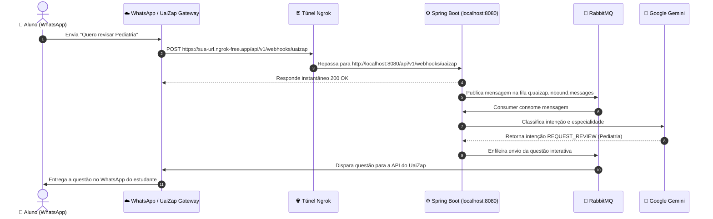

# 🌐 Guia Prático: Configuração do Ngrok para Webhooks do WhatsApp

Este guia passo a passo ensina como expor a sua aplicação local (**Spring Boot na porta 8080**) para a internet utilizando o **Ngrok**, permitindo que o gateway do WhatsApp (UaiZap, Evolution API, Z-API, etc.) envie eventos e mensagens em tempo real para o seu computador de desenvolvimento.

---

## 🎯 Por que o Ngrok é necessário?

Quando um estudante de medicina envia uma mensagem no WhatsApp:
1. A mensagem chega aos servidores do WhatsApp e é repassada para o seu **Gateway de WhatsApp** (UaiZap).
2. O UaiZap precisa disparar uma requisição HTTP (`POST`) com os dados da mensagem para o seu backend.
3. Como seu computador está rodando em `localhost:8080` (atrás do roteador/firewall), o UaiZap não consegue enxergar o seu IP privado.
4. O **Ngrok** cria um **túnel criptografado e seguro** fornecendo uma URL pública da internet (ex: `https://meu-bot-tcc.ngrok-free.app`) que encaminha tudo instantaneamente para o seu `http://localhost:8080`.

---

## 📥 1. Instalando o Ngrok no Windows

Escolha uma das opções abaixo:

### Opção A: Via Winget (Recomendado / PowerShell)
Abra o PowerShell e execute:
```powershell
winget install ngrok.ngrok
```

### Opção B: Via Chocolatey
```powershell
choco install ngrok
```

### Opção C: Download Direto
1. Acesse: [https://ngrok.com/download](https://ngrok.com/download)
2. Baixe o `.zip` para Windows, extraia o arquivo `ngrok.exe` e coloque em uma pasta (ex: `C:\ngrok` ou adicione às variáveis de ambiente do Windows / `PATH`).

---

## 🔑 2. Criando Conta Gratuita e Configurando o Authtoken

1. Crie uma conta gratuita em: [https://dashboard.ngrok.com/signup](https://dashboard.ngrok.com/signup)
2. Após o login, acesse: [https://dashboard.ngrok.com/get-started/your-authtoken](https://dashboard.ngrok.com/get-started/your-authtoken)
3. Copie o seu token de autenticação e execute no terminal:
   ```bash
   ngrok config add-authtoken SEU_AUTHTOKEN_AQUI
   ```

---

## 💡 3. Dica de Ouro: Domínio Estático Gratuito (Static Domain)
O Ngrok gratuito oferece **1 domínio estático gratuito vitalício** para que sua URL pública **nunca mude** quando você reiniciar o computador!

1. No dashboard do Ngrok, vá em: **Cloud Edge -> Domains** ([https://dashboard.ngrok.com/cloud-edge/domains](https://dashboard.ngrok.com/cloud-edge/domains)).
2. Clique em **Create Domain** (ex: `exemplo-tcc-medicina.ngrok-free.app`).
3. Ao iniciar o túnel, basta usar o parâmetro `--domain`:
   ```bash
   ngrok http 8080 --domain=exemplo-tcc-medicina.ngrok-free.app
   ```
*(Assim, você cadastra o webhook no WhatsApp uma única vez e nunca mais precisa alterar!)*

---

## 🚀 4. Iniciando o Túnel Local

### Modo 1: Via Script Facilitador (Já incluído no projeto)
Na raiz do projeto, execute:
```powershell
.\scripts\start-tunnel.ps1
```
ou dê dois cliques no arquivo:
```cmd
scripts\start-tunnel.bat
```

### Modo 2: Via Comando Direto
```bash
ngrok http 8080
```

Você verá uma tela parecida com esta no terminal:
```text
ngrok                                                               (Ctrl+C to quit)

Session Status                online
Account                       Seu Nome (Plan: Free)
Version                       3.x.x
Region                        South America (sa)
Latency                       18ms
Web Interface                 http://127.0.0.1:4040
Forwarding                    https://a1b2-c3d4.ngrok-free.app -> http://localhost:8080
```

Copie a URL que começa com **`https://`** (ex: `https://a1b2-c3d4.ngrok-free.app`).

---

## 📲 5. Configurando o Webhook no Gateway do WhatsApp (UaiZap)

1. Acesse o painel da sua instância no **UaiZap** (ou gateway equivalente).
2. Vá nas configurações de **Webhooks**.
3. No campo **URL do Webhook**, cole:
   ```http
   https://SUA_URL_NGROK.ngrok-free.app/api/v1/webhooks/uaizap
   ```
4. Configure os eventos a serem escutados:
   - Marque a opção: `messages.upsert` (mensagens recebidas).
5. No campo de **Headers Personalizados / Secret Token**, adicione:
   - **Header**: `X-Webhook-Secret`
   - **Valor**: `med_secret_key_123` *(deve ser o mesmo valor definido no seu arquivo `.env`)*.
6. Clique em **Salvar**.

---

## 🧪 6. Inspecionando Requisições em Tempo Real (Painel Web do Ngrok)

O Ngrok disponibiliza um painel web local para você visualizar exatamente o JSON que o WhatsApp está enviando:

1. Enquanto o Ngrok estiver rodando, abra o navegador em:
   [http://localhost:4040](http://localhost:4040)
2. Você verá:
   - Todas as requisições HTTP recebidas em tempo real.
   - Headers e Payload JSON completo enviado pelo WhatsApp.
   - Código de status de resposta retornado pelo Spring Boot (`200 OK`).
   - Botão **"Replay"** para reenviar qualquer mensagem anterior sem precisar digitar no celular novamente!

---

## 🛠️ 7. Fluxo Completo de Teste Local



---

<p align="center">
  Pronto! Com o Ngrok conectado e a aplicação rodando, seu ambiente de desenvolvimento local estará 100% interativo com o WhatsApp real.
</p>
