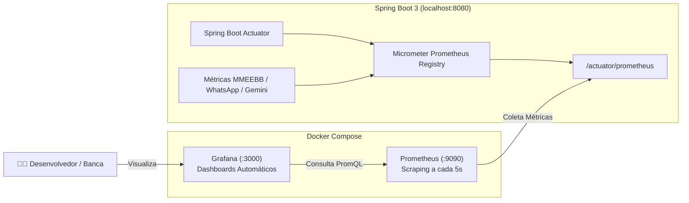

# 📊 Guia de Observabilidade: Prometheus & Grafana

Este guia documenta a stack de observabilidade e monitoramento em tempo real do **Chatbot de Repetição Espaçada MMEEBB** para Medicina.

---

## 🏗️ Arquitetura da Stack



---

## 🚀 Como Executar a Stack de Monitoramento

### 1. Subir os Containers Docker
Execute no terminal na raiz do projeto:
```bash
docker compose up -d
```

Containers ativos:
- **PostgreSQL + pgvector**: porta `5432`
- **RabbitMQ Management**: portas `5672` (AMQP) e `15672` (Web UI)
- **Redis**: porta `6379`
- **Prometheus**: porta `9090` (Scraper de métricas)
- **Loki**: porta `3100` (Agregador de logs indexados)
- **Promtail**: Coletor de logs de todos os containers
- **Grafana**: porta `3000` (Painéis, métricas e central de logs)

---

## 🌐 Links e Credenciais de Acesso

| Serviço | URL | Credenciais Padrão | Descrição |
| :--- | :--- | :--- | :--- |
| **Grafana** | `http://localhost:3000` | `admin` / `admin` | Painel visual com Métricas e Central de Logs & Tracing |
| **Prometheus** | `http://localhost:9090` | Sem autenticação | Console de consultas PromQL e status dos *targets* |
| **Loki** | `http://localhost:3100` | Sem autenticação | Endpoint de logs e consultas LogQL |
| **Actuator Endpoint** | `http://localhost:8080/actuator/prometheus` | Sem autenticação | Endpoint OpenMetrics exposto pelo Spring Boot |
| **RabbitMQ Management** | `http://localhost:15672` | `guest` / `guest` | Monitoramento das filas AMQP (`q.uaizap.*`, `q.med.*`) |

---

## 🔍 Rastreabilidade Distribuída (Trace ID, Span ID e MDC)

Cada requisição do WhatsApp e execução assíncrona recebe identificadores de rastreamento únicos propagados pelo **Micrometer Tracing (Brave)**:

- **`traceId`**: Identificador global da transação de ponta a ponta (ex: `66b9f20e4c5b1a90`).
- **`spanId`**: Identificador do segmento específico de execução.
- **`studentPhone`**: Telefone do estudante de medicina enriquecido via MDC do SLF4J/Logback.
- **`messageId`**: ID único da mensagem do WhatsApp enviado pelo gateway UaiZap.

**Formato dos Logs no Console e Loki:**
```text
2026-08-11 12:20:00.123  INFO [med-mmeebb-chatbot,66b9f20e4c5b1a90,4c5b1a90] 42804 --- [pool-1-thread-1] b.e.u.t.service.impl.ChatbotServiceImpl : Processando mensagem do WhatsApp [5534999998888]: 'Alternativa A'
```

No Grafana, você pode buscar diretamente:
- Por Trace ID: `{container=~".*"} |= "66b9f20e4c5b1a90"`
- Por Telefone do Aluno: `{container=~".*"} |= "5534999998888"`
- Por Palavra-chave: `{container=~".*"} |= "ERROR"`

---

## 📈 Painéis do Dashboard Provisionado

O Grafana já inicia com o dashboard **"Med-MMEEBB Chatbot — Painel de Observabilidade"** automaticamente configurado:

### 1. 🧠 Visão Geral de Negócio (MMEEBB & WhatsApp)
- **Total de Revisões Processadas**: Quantidade acumulada de respostas de flashcards processadas pelo algoritmo $2^n$.
- **Taxa de Acerto Global (%)**: Gauge visual com faixas de retenção da memória ($>70\%$ verde, $50-70\%$ amarelo, $<50\%$ vermelho).
- **Taxa de Respostas (Acerto vs Erro)**: Gráfico de série temporal diferenciando acertos de erros ao longo do tempo.
- **Vazão de Mensagens WhatsApp**: Gráfico de vazão diferenciando mensagens recebidas (`INBOUND`) e despachadas com delay Anti-Ban (`OUTBOUND`).
- **Interações com IA (Google Gemini)**: Total de acionamentos do Tutor Clínico e NLU.

### 2. ⚙️ Performance da JVM & Sistema (Spring Boot 3)
- **Memória Heap da JVM**: Uso de memória Heap em tempo real vs limite máximo configurado.
- **Uso de CPU**: Consumo de processador da aplicação e do sistema operacional.

### 3. 🌐 Tráfego HTTP & Webhooks
- **Taxa de Requisições por Status**: Gráfico de RPS segmentado por código HTTP (200, 4xx, 5xx).
- **Latência de Resposta HTTP**: Percentis de latência **P95** e **P99** para controle de SLA.

### 4. 📜 Central de Logs & Tracing em Tempo Real (Loki)
- Visualizador interativo de logs de todos os containers (`app`, `rabbitmq`, `postgres`, `redis`) com busca textual e highlighting.

---

## 🧪 Métricas Customizadas de Domínio (Micrometer)

| Nome da Métrica | Tipo | Tags | Descrição |
| :--- | :--- | :--- | :--- |
| `med_mmeebb_reviews_total` | `Counter` | `result` (`correct`, `incorrect`), `specialty` | Respostas registradas no algoritmo de repetição espaçada |
| `med_mmeebb_uaizap_messages_total` | `Counter` | `direction` (`INBOUND`, `OUTBOUND`), `type` (`TEXT`, `QUESTION`) | Volume de mensagens trafegadas no gateway WhatsApp |
| `med_mmeebb_ai_interactions_total` | `Counter` | `type` (`INTENT_CLASSIFIER`, `CLINICAL_TUTOR`), `fallback` (`true`, `false`) | Interações cognitivas com o Google Gemini |
