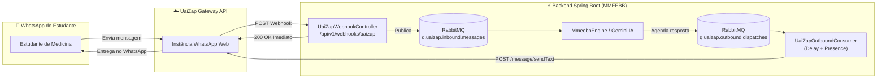

# 📡 Documentação Técnica de Integração: UaiZap (WhatsApp Gateway API)

Este documento descreve detalhadamente a arquitetura de integração, contratos de API (endpoints REST), payloads de Webhooks, estratégias de resiliência e políticas anti-bloqueio adotadas na comunicação entre o **Backend Spring Boot** e o gateway **UaiZap / Uaizapi**.

---

## 🏗️ 1. Arquitetura da Integração

A integração com o WhatsApp opera em um modelo **Híbrido e Assíncrono**:
- **Inbound (Entrada de Mensagens do Estudante)**: Webhook HTTP `POST` recebido pelo Spring Boot ➔ Validação de Segurança ➔ Broker **RabbitMQ** (`q.uaizap.inbound.messages`) ➔ Resposta HTTP imediata `200 OK`.
- **Outbound (Disparo de Questões e Feedbacks)**: Fila RabbitMQ (`q.uaizap.outbound.dispatches`) ➔ Consumidor com controle de vazão (Taxa de 1 msg / ~6s) ➔ Chamada REST `POST` para a API do UaiZap.



---

## 🔐 2. Autenticação e Segurança

Todas as chamadas entre o backend e a API do UaiZap exigem autenticação via Header HTTP:

| Direção | Header | Descrição | Configuração `.env` |
| :--- | :--- | :--- | :--- |
| **Outbound** (Spring Boot ➔ UaiZap) | `apikey: <TOKEN>` | Chave de autenticação gerada na criação da instância | `UAIZAP_TOKEN` |
| **Inbound** (UaiZap ➔ Spring Boot) | `X-Webhook-Secret: <SECRET>` | Token secreto para validar que a requisição partiu do gateway oficial | `UAIZAP_WEBHOOK_SECRET` |

---

## 📥 3. Webhook de Entrada (Inbound Payload)

### Endpoint Receptor no Spring Boot:
* **Método**: `POST`
* **URL**: `/api/v1/webhooks/uaizap`
* **Headers Esperados**:
  * `Content-Type: application/json`
  * `X-Webhook-Secret: med_secret_key_123` (opcional/configurável)

### Exemplo de Payload JSON Recebido (`event: messages.upsert`):

```json
{
  "event": "messages.upsert",
  "instance": "unipam_med_bot",
  "data": {
    "key": {
      "remoteJid": "5534999999999@s.whatsapp.net",
      "fromMe": false,
      "id": "BAE59A83E58C3B12"
    },
    "pushName": "Níckolas Tavares",
    "message": {
      "conversation": "Quero revisar questoes de cardiologia"
    },
    "messageType": "conversation",
    "messageTimestamp": 1723389845
  }
}
```

### Campos Principais Mapeados:
- `data.key.remoteJid`: Identificador WhatsApp do remetente (número de telefone).
- `data.key.fromMe`: Booleano que indica se a mensagem foi enviada pelo próprio bot (`true`) ou pelo aluno (`false`). O backend descarta mensagens `fromMe == true` para evitar loops infinitos.
- `data.pushName`: Nome de perfil do aluno no WhatsApp.
- `data.message.conversation` ou `data.message.extendedTextMessage.text`: Conteúdo textual enviado pelo estudante.

---

## 📤 4. Endpoints REST da API UaiZap (Outbound)

A URL base padrão é configurada via variável `UAIZAP_BASE_URL` (ex: `https://api.uaizap.com.br` ou instância local/self-hosted).

### 4.1. Envio de Mensagem de Texto
Envia mensagens de texto puro formatadas com Markdown básico do WhatsApp (`*negrito*`, `_itálico_`, `~tachado~`, ` ```código``` `).

* **Método**: `POST`
* **URL**: `/message/sendText/{instance}`
* **Headers**:
  * `Content-Type: application/json`
  * `apikey: {{UAIZAP_TOKEN}}`

#### Request Body:
```json
{
  "number": "5534999999999",
  "options": {
    "delay": 1200,
    "presence": "composing",
    "linkPreview": false
  },
  "textMessage": {
    "text": "📚 *REVISÃO MMEEBB - CARDIOLOGIA (UNIPAM)*\n\n*Caso Clínico:*\nPaciente masculino, 58 anos, hipertenso, dá entrada com dor precordial opressiva...\n\n*Alternativas:*\n*A)* Realizar ECG em até 10 minutos\n*B)* Solicitar apenas troponina e aguardar\n*C)* Prescrever analgésico e alta\n*D)* Administrar AAS e aguardar vaga de UTI\n\n_👉 Responda apenas com a letra (A, B, C ou D)_"
  }
}
```

#### Response Sucesso (`200 OK` / `201 Created`):
```json
{
  "status": "SUCCESS",
  "messageId": "BAE59A83E58C3B12",
  "to": "5534999999999@s.whatsapp.net"
}
```

---

### 4.2. Envio de Mídia (Imagens / ECGs / Radiografias / PDFs)
Utilizado para envio de casos clínicos baseados em imagens diagnósticas ou resumos em PDF.

* **Método**: `POST`
* **URL**: `/message/sendMedia/{instance}`
* **Headers**:
  * `Content-Type: application/json`
  * `apikey: {{UAIZAP_TOKEN}}`

#### Request Body:
```json
{
  "number": "5534999999999",
  "mediaMessage": {
    "mediatype": "image",
    "caption": "🔍 Analise o traçado eletrocardiográfico acima para responder a questão.",
    "media": "https://meu-servidor.unipam.edu.br/imagens/ecg-caso-12.jpg"
  }
}
```

---

### 4.3. Simulação de Presença ("Digitando...")
Sinaliza para o estudante que o bot está processando o raciocínio ou gerando a resposta médica.

* **Método**: `POST`
* **URL**: `/chat/sendPresence/{instance}`
* **Headers**:
  * `Content-Type: application/json`
  * `apikey: {{UAIZAP_TOKEN}}`

#### Request Body:
```json
{
  "number": "5534999999999",
  "presence": "composing",
  "delay": 2500
}
```
*Valores suportados para `presence`*: `composing` (digitando), `recording` (gravando áudio), `paused` (parado).

---

### 4.4. Verificação de Saúde da Conexão (Health Check)
Permite ao backend ou script de monitoramento validar se a instância do WhatsApp continua conectada.

* **Método**: `GET`
* **URL**: `/instance/connectionState/{instance}`
* **Headers**:
  * `apikey: {{UAIZAP_TOKEN}}`

#### Response:
```json
{
  "instance": "unipam_med_bot",
  "state": "open"
}
```
*Estados possíveis*:
- `open`: Conectado e pronto para operar.
- `connecting`: Tentando restabelecer conexão com o WhatsApp Web.
- `close`: Desconectado (necessário escanear novo QR Code).

---

## 🛡️ 5. Estratégias Anti-Bloqueio / Anti-Ban (Diretrizes da Meta)

Para evitar que o número do WhatsApp seja temporariamente bloqueado por suspeita de spam da Meta, a integração implementa as seguintes salvaguardas:

1. **Vazão Controlada (Single Concurrency Worker)**:
   - O consumidor RabbitMQ `UaiZapOutboundConsumer` é configurado com concorrência unitária (`concurrency = 1`), garantindo que disparos ocorram estritamente em fila sequencial.
2. **Delay Dinâmico com Jitter Aleatório**:
   - Intervalo padrão de **6 segundos** entre cada mensagem enviada, acrescido de uma variação aleatória de **±1 a 2 segundos**, simulando cadência humana.
3. **Presença de Digitação Automática (`composing`)**:
   - Antes de enviar o texto, o bot aciona o evento `composing` durante 2 segundos.
4. **Respostas Reativas sob Demanda**:
   - Em vez de disparar 50 mensagens em rajada de uma só vez, o bot prioriza disparos reativos (quando o aluno digita no WhatsApp) ou fracionamento em lotes diários.

---

## 📊 6. Tabela de Variáveis de Ambiente (`.env`)

```properties
# ==========================================
# UaiZap WhatsApp Gateway Configuration
# ==========================================
UAIZAP_BASE_URL=https://api.uaizap.com.br
UAIZAP_INSTANCE=unipam_med_bot
UAIZAP_TOKEN=seu_token_de_autenticacao_aqui
UAIZAP_WEBHOOK_SECRET=med_secret_key_123

# Controle de Vazão e Anti-Ban
UAIZAP_SEND_DELAY_SECONDS=6
UAIZAP_PRESENCE_ENABLED=true
```

---

## 🔗 Documentos Relacionados
- [Guia Prático de Configuração do UaiZap (Passo a Passo com Telas)](GUIA_CONFIGURACAO_UAIZAP.md)
- [Guia de Túnel Local com Ngrok](GUIA_NGROK_WEBHOOK.md)
- [README Principal do Projeto](../README.md)
